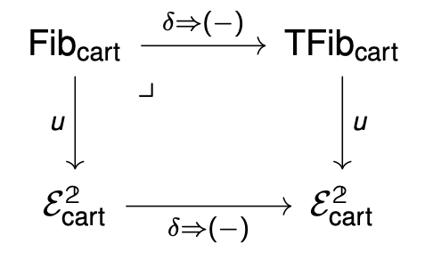

<a href="https://uclouvain.be/fr/instituts-recherche/irmp/workshop-on-category-theory-uclouvain-and-j-hopkins.html" target="_blank"> <i class="fa fa-external-link" aria-hidden="true"></i> Website of the meeting </a>

<a href="https://cdn.uclouvain.be/groups/cms-editors-irmp/frobenius_sina.pdf" target="_blank"> <i class="fa fa-file-pdf-o" aria-hidden="true"></i> My Talk (based on joint work with Emily Riehl)</a>

